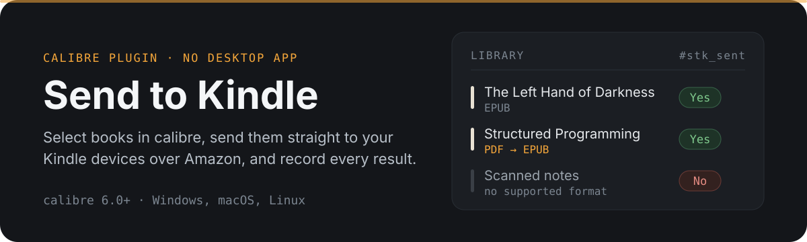
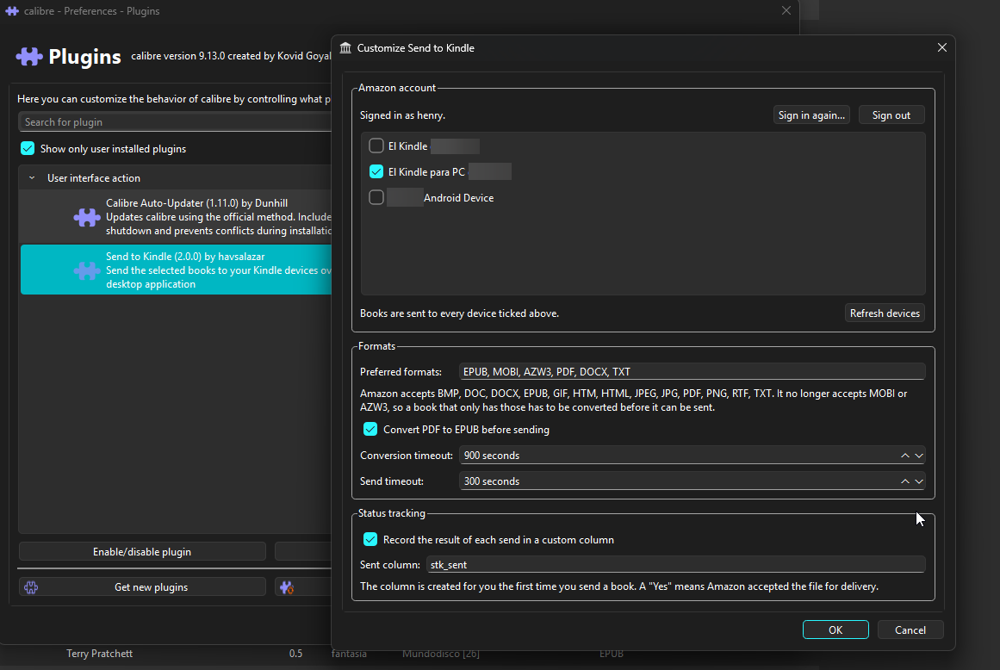
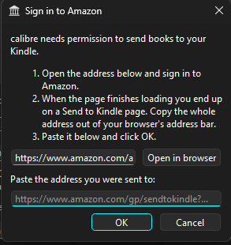
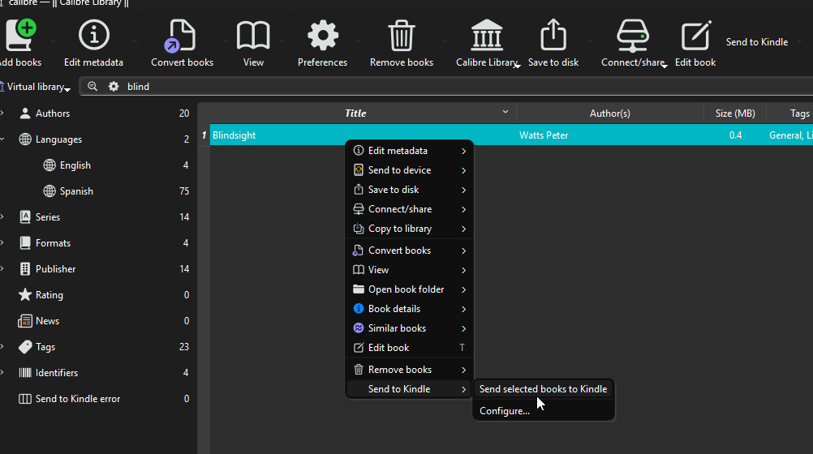
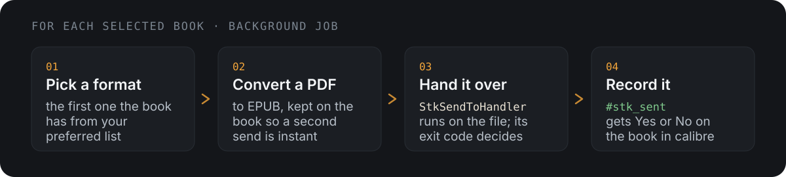

<p align="center">
  
</p>

A calibre plugin that sends the books you select **straight to your Kindle devices**,
converting PDFs to EPUB on the way and recording the outcome of every send in your
library.

It talks to Amazon's Send to Kindle service directly, so there is nothing else to
install: no desktop application, and no Python packages. Works on **Windows, macOS and
Linux**, and is not subject to the 10 MB limit of the send-to-Kindle email address.

> [!IMPORTANT]
> This uses Amazon's private Send to Kindle API, by way of a vendored copy of
> [stkclient](https://github.com/maxdjohnson/stkclient) (MIT). It is not an official or
> documented interface, and Amazon can change it at any time without notice.

## Install

```sh
./build.sh
calibre-customize -a send_to_kindle.zip
```

Or straight from a checkout, without building a ZIP:

```sh
calibre-customize -b /path/to/sendToKindle
```

Restart calibre, then add the plugin to a toolbar via *Preferences → Toolbars & menus*
if it is not already there.

## Setup

**These steps are required before the first send.** Until you have signed in and picked
at least one device, the plugin will tell you so instead of sending anything.

Open *Preferences → Plugins → Send to Kindle → Customize*, or **Configure…** in the
plugin's right-click menu.

<p align="center">
  
</p>

### 1. Sign in to Amazon

Click **Sign in**. The dialog shows you an Amazon sign-in address:

<p align="center">
  
</p>

1. Click **Open in browser** and sign in to the Amazon account your Kindles are
   registered to.
2. You end up on a Send to Kindle page. **Copy the whole address out of your browser's
   address bar** — it carries the one-time code that authorizes calibre.
3. Paste it into the dialog and click **OK**.

The address is long and the field only shows the start of it; that is fine, use **Open in
browser** rather than trying to read it.

The group box then reads *Signed in as …*. This is a one-time step: the plugin stays
signed in until you sign out, so you never have to do it again per send.

Your calibre appears as a device named **calibre** in Amazon's
[Manage Your Content and Devices](https://www.amazon.com/hz/mycd/digital-console/alldevices).

### 2. Choose your devices

Click **Refresh devices** to list the Kindles on the account, then **tick the ones you
want books delivered to**. Every ticked device gets every book you send.

Kindle apps on phones and PCs show up here too, so untick anything you would rather not
fill with books.

### 3. Send a book

Select one or more books and choose **Send to Kindle**, from the toolbar button or from
the right-click menu.

<p align="center">
  
</p>

The work runs as a background job, so calibre stays usable and progress shows in the
jobs panel.

<p align="center">
  
</p>

The converted EPUB is added to the book, so a second send does not convert again.

## Your Amazon account stays on your computer

> [!NOTE]
> **The plugin never sees your Amazon password, and your credentials are never sent
> anywhere except Amazon itself.** There is no account to create, no server run by this
> project, and nothing is uploaded to the plugin author or to any third party.

In detail:

- **You sign in on Amazon's own page, in your own browser.** The plugin only ever
  receives the address you paste back, which carries a one-time authorization code — not
  your password, and not your Amazon session.
- **What is stored is a device registration**, the same kind of credential a Kindle app
  holds: a private key and an authentication token, saved to a single file on your
  computer. Amazon sees the token, as it must in order to recognise your calibre. The
  private key never goes over the network at all — it stays on your machine and is only
  used locally to sign each request.
- **The only servers contacted are Amazon's**, and only while you are signing in or
  sending a book:

  | Host | When | What for |
  | --- | --- | --- |
  | `www.amazon.com` | sign-in | The sign-in page, opened in **your browser** — the plugin itself never calls it |
  | `api.amazon.com` | sign-in | Exchanging the one-time code for a token |
  | `firs-ta-g7g.amazon.com` | sign-in, sign-out | Registering and deregistering calibre as a device |
  | `stkservice.amazon.com` | each send | Listing devices, requesting an upload URL, requesting delivery |
  | an Amazon upload host | each send | Receiving the book file. The address is supplied by Amazon in the previous step |

- **No analytics, no telemetry, no usage reporting.** The plugin makes no network request
  that is not one of the above.
- **Sign out** asks Amazon to remove the registration and deletes the local file, so
  nothing is left behind.

The file is `send_to_kindle_client.json`, in the `plugins` directory of calibre's
configuration directory:

| Platform | Path |
| --- | --- |
| Linux | `~/.config/calibre/plugins/send_to_kindle_client.json` |
| macOS | `~/Library/Preferences/calibre/plugins/send_to_kindle_client.json` |
| Windows | `%APPDATA%\calibre\plugins\send_to_kindle_client.json` |

It is created readable only by your user. Windows ignores that mode, so there it is
protected by the permissions on the calibre configuration directory itself. Treat it like
a password: anyone who copies it can send books to your Kindles until you sign out.

All of this is in [`auth.py`](./auth.py) and [`stkclient/`](./stkclient/) if you would
rather read it than take our word for it.

## Configuration

| Setting | Default | Meaning |
| --- | --- | --- |
| Amazon account | not signed in | Sign in once; the devices below come from this account. |
| Devices | none | Books are delivered to every device ticked. |
| Preferred formats | `EPUB, PDF, DOCX, TXT` | Most preferred first; the first format the book actually has is sent. |
| Convert PDF to EPUB | on | Applies when the file that would be sent is a PDF. |
| Conversion timeout | 900 s | Per book. PDF conversion is slow. |
| Send timeout | 300 s | Per request to Amazon. Large books take a while to upload. |
| Record the result | on | Writes to the tracking column below. |
| Sent column | `stk_sent` | Lookup name, without the leading `#`. |

### Formats

Amazon accepts EPUB, PDF, DOCX, DOC, TXT, RTF, HTM, HTML, JPEG, JPG, PNG, GIF and BMP.

**MOBI and AZW3 are not accepted** — Amazon dropped them in 2022. A book that has only
those formats is reported as a failure rather than uploaded in vain; convert it to EPUB
in calibre first.

### Upgrading from 1.x

Your existing settings are kept, which means **the preferred formats list still contains
MOBI and AZW3** even though Amazon no longer accepts them. They are ignored, so nothing
breaks, but you may want to remove them from the list to match the new default.

Version 1.x needed a path to `StkSendToHandler.exe`; that setting is gone, along with the
Windows-only restriction. Sign in as described above and the plugin takes it from there.

## Tracking column

The first time you send a book, the plugin offers to create one custom column,
`#stk_sent` (Yes/No).

calibre only picks up new custom columns at startup, so **restart calibre after it is
created**; that first batch is still sent, it just is not recorded.

A `Yes` means Amazon accepted the file for delivery and returned an identifier for it,
which is logged in the job. Delivery to a device that is currently offline still happens
when it next connects.

Books that fail before any send — no formats, only MOBI/AZW3, a missing file in the
library, a failed PDF conversion — are recorded as `No` and are not uploaded. The reason
for each failure is listed in the summary dialog at the end of the job.

<details>
<summary><b>Project files</b></summary>

<br>

| File | Purpose |
| --- | --- |
| `__init__.py` | Plugin metadata and the configuration hooks |
| `config.py` | Preferences (`JSONConfig`) and the config widget |
| `auth.py` | Credential storage and the Amazon sign-in dialog |
| `action.py` | The toolbar action: pre-flight check, conversion, sending, recording |
| `stkclient/` | Vendored [stkclient](https://github.com/maxdjohnson/stkclient) (MIT), patched to need only the standard library |
| `plugin-import-name-send_to_kindle.txt` | Empty; required by calibre for multi-file plugins |
| `build.sh` | Builds `send_to_kindle.zip` |

</details>

<details>
<summary><b>Changes to the vendored stkclient</b></summary>

<br>

| Change | Why |
| --- | --- |
| Imports made relative | It lives inside `calibre_plugins.send_to_kindle`, not at the top level |
| `rsa` replaced by `stkclient/_rsa.py` | The package only used a PKCS#1 key parse and one modular exponentiation, both of which are a few lines of standard library. Dropping it means the plugin needs nothing installed |
| Random device serial, model `calibre` | Upstream registers every user as the same hardcoded device |
| `api.TIMEOUT` on every request | Upstream calls had no timeout, so a stalled upload hung the job thread forever |
| `datetime.utcnow()` replaced | Deprecated on the Python version current calibre ships |

`defusedxml` is not vendored; the upstream code already falls back to the standard
library XML parser when it is absent.

</details>

## Thanks

This plugin exists because of **[stkclient](https://github.com/maxdjohnson/stkclient)** by
[Max Johnson](https://github.com/maxdjohnson), which works out how Amazon's Send to Kindle
service actually talks to its clients — the OAuth2 device flow, the device registration,
and the RSA request signing that every call depends on. Working that out from scratch is
the hard part of this project, and it was already done, carefully and readably.

A copy lives in [`stkclient/`](./stkclient/), used under the MIT licence, © 2022 Max
Johnson. The full licence text is kept alongside it in
[`stkclient/LICENSE`](./stkclient/LICENSE), and the changes made to the vendored copy are
listed above. If it is useful to you, please [star the original
repository](https://github.com/maxdjohnson/stkclient).
