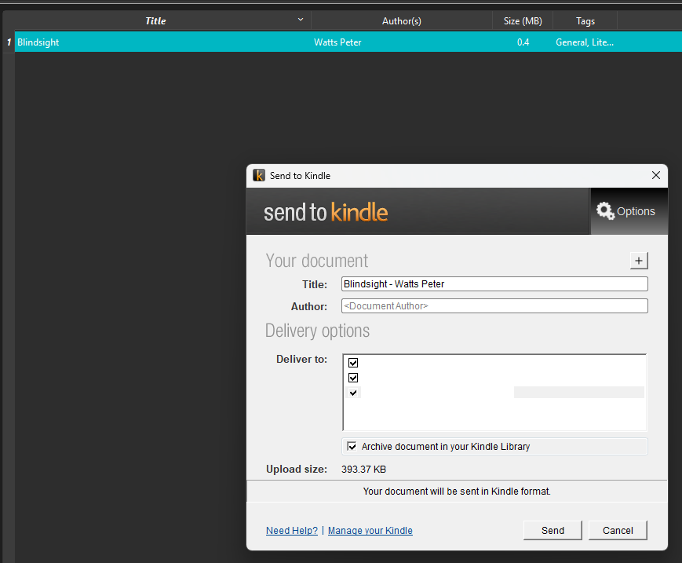

<p align="center">
  
</p>

A calibre plugin that sends the books you select to the Amazon **Send to Kindle**
desktop application (`StkSendToHandler.exe`), converting PDFs to EPUB on the way and
recording the outcome of every send in your library.

**Windows only** — it drives the Windows Send to Kindle application.

## Install

```sh
./build.sh
calibre-customize -a send_to_kindle.zip
```

Or straight from a checkout, without building a ZIP:

```sh
calibre-customize -b /path/to/sendToKindle
```

Restart calibre, then add the plugin to a toolbar via *Preferences → Toolbars & menus*
if it is not already there.

## Usage

Select one or more books and choose **Send to Kindle**, from the toolbar button or from
the right-click menu.

<p align="center">
  
</p>

The work runs as a background job, so calibre stays usable and progress shows in the
jobs panel.

<p align="center">
  
</p>

The converted EPUB is added to the book, so a second send does not convert again.

Each file is handed to the Amazon Send to Kindle application, which takes it from there:

<p align="center">
  
</p>

If the Send to Kindle application is not installed, nothing is sent — you get a dialog
naming the paths that were checked, a link to <https://www.amazon.com/sendtokindle>,
and an offer to open the configuration so you can point the plugin at your install.

## Configuration

*Preferences → Plugins → Send to Kindle → Customize*, or **Configure…** in the
right-click menu.

<p align="center">
  
</p>

| Setting | Default | Meaning |
| --- | --- | --- |
| Path to `StkSendToHandler.exe` | empty | Empty means autodetect the standard install locations. Set it for a custom install. |
| Preferred formats | `EPUB, MOBI, AZW3, PDF, DOCX, TXT` | Most preferred first; the first format the book actually has is sent. |
| Convert PDF to EPUB | on | Applies when the file that would be sent is a PDF. |
| Conversion timeout | 900 s | Per book. PDF conversion is slow. |
| Send timeout | 15 s | Per book. |
| Record the result | on | Writes to the tracking column below. |
| Sent column | `stk_sent` | Lookup name, without the leading `#`. |

## Tracking column

The first time you send a book, the plugin offers to create one custom column,
`#stk_sent` (Yes/No).

calibre only picks up new custom columns at startup, so **restart calibre after it is
created**; that first batch is still sent, it just is not recorded.

> **A `Yes` means the file was handed to the Send to Kindle application without an
> error.** The application usually exits immediately and uploads in the background, so
> it is not a confirmation from Amazon that the book reached your device.

Books that fail before any send — no formats, a missing file in the library, a failed
PDF conversion — are recorded as `No` and are not sent. The reason for each failure is
listed in the summary dialog at the end of the job.

<details>
<summary><b>Project files</b></summary>

<br>

| File | Purpose |
| --- | --- |
| `__init__.py` | Plugin metadata and the configuration hooks |
| `config.py` | Preferences (`JSONConfig`), executable autodetection, config widget |
| `action.py` | The toolbar action: pre-flight check, conversion, sending, recording |
| `plugin-import-name-send_to_kindle.txt` | Empty; required by calibre for multi-file plugins |
| `build.sh` | Builds `send_to_kindle.zip` |

</details>
